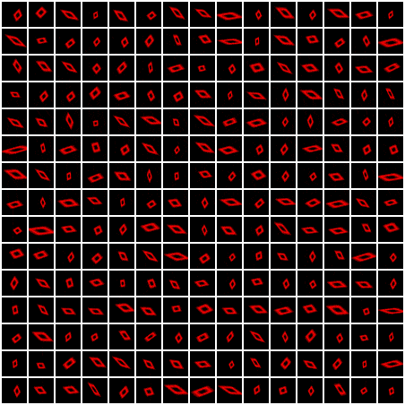

# STAWM

Code for the ICLR2019 submission 'A Biologically Inspired Visual Working Memory for Deep Networks'.
The memory module can be found in memory.py and each experiment has its own file.

## Examples

### MNIST

Reconstruction (sketch) sequences for 36 glimpses / sketches of size 4, memory size: 128, latent size: 4. Note that this is significantly more glimpses than used in the paper in order to obtain a reasonable animation, but also shows that the memory can learn a useful representation over very long sequences.

### CelebA

Segmentation over time for the model from the paper. Here we plot the masked images according to the alpha channel of the final sketch. As the model trains this alpha channel moves from a uniform representation, to a segmented facial region.

